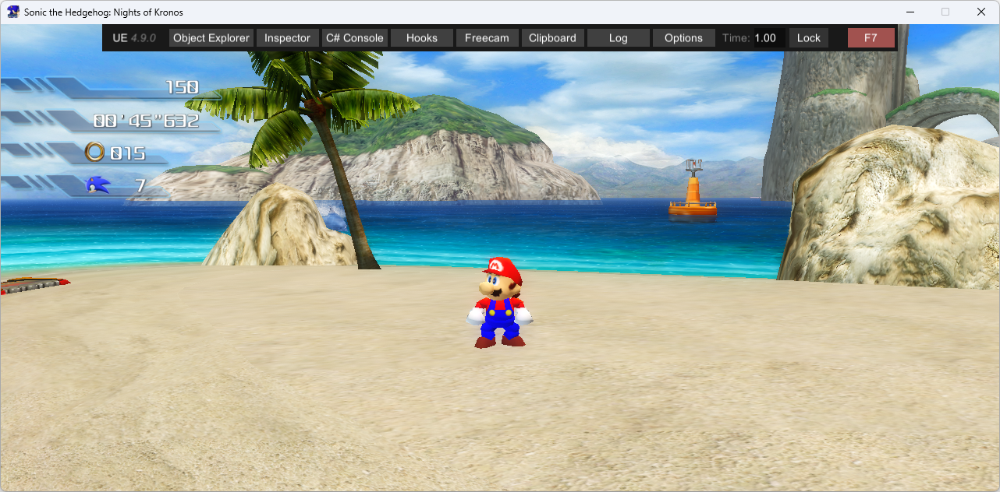

# sm64-project-06

Mod for Project 06 made with [libsm64-unity-melonloader](https://github.com/headshot2017/libsm64-unity-melonloader) which replaces the player character with SM64 Mario

Still in development

## Third-party libraries
* [ObjLoader](https://github.com/chrisjansson/ObjLoader), used to load the level's collision meshes from external .obj files ripped from the game
